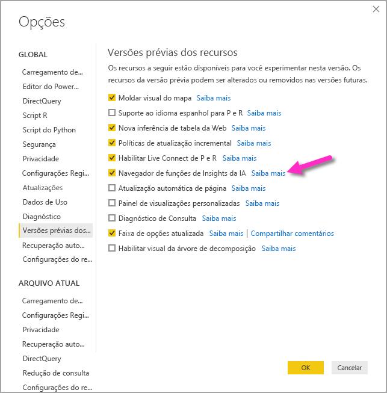
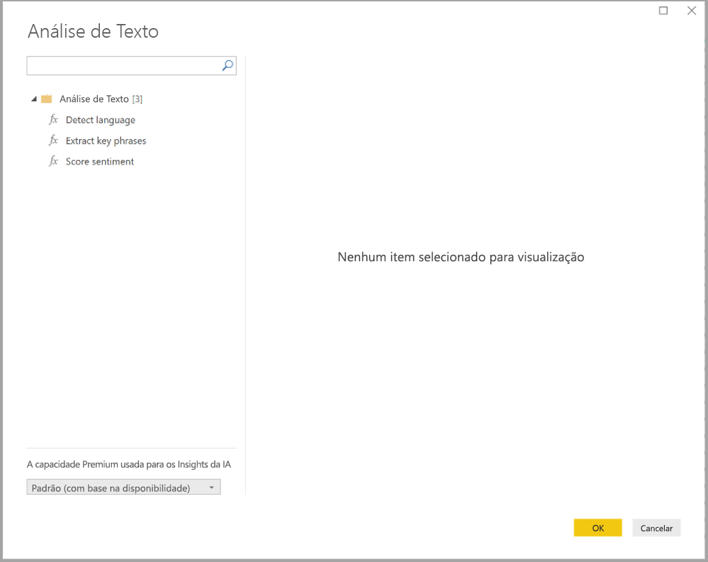
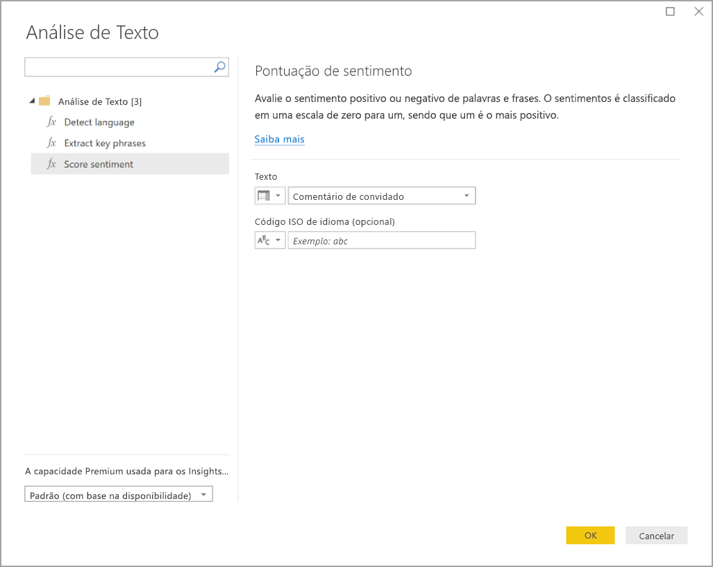
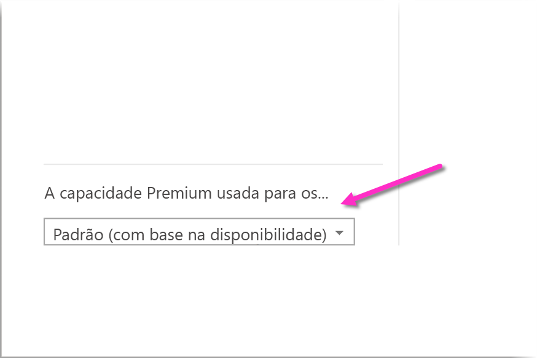
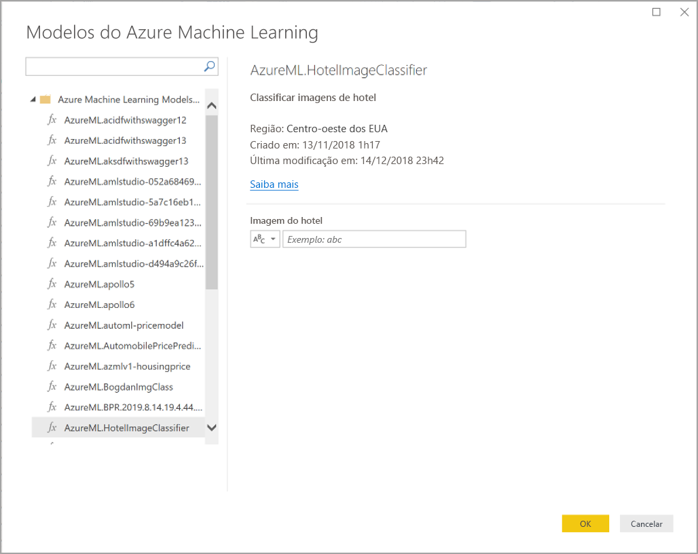

# Usar os Insights da IA no Power BI Desktop

No Power BI, você pode usar os Insights da IA para obter acesso a uma coleção de modelos de machine learning pré-treinados que aprimoram seus esforços de preparação de dados. Os Insights da IA são acessados no **Editor do Power Query**, e seus recursos e funções associados são acessados por meio das guias **Página Inicial** e **Adicionar Coluna** no **Editor do Power Query**. 

Este artigo descreve as funções Análise de Texto e Pesquisa Visual, ambas dos Serviços Cognitivos do Azure. Também neste artigo está uma seção que descreve as funções personalizadas disponíveis no Power BI no Azure Machine Learning.

## Como habilitar os Insights da IA

Os Insights da IA foram disponibilizados para o público geral na versão de junho de 2020 do Power BI Desktop. Em versões anteriores do Power BI Desktop, os Insights da IA no Power BI devem ser habilitados selecionando **Arquivo > Opções e configurações > Opções** e **Versão prévia dos recursos** na coluna à esquerda. No painel direito, há uma seleção **Navegador de funções dos Insights da IA**. Marque a caixa ao lado de **Navegador de funções dos Insights da IA** para habilitar o recurso de visualização. Será preciso reiniciar o Power BI Desktop para que a alteração do recurso de visualização tenha efeito.

> [!NOTE]
> Os Insights da IA estão disponíveis para o público geral em todas as versões do Power BI Desktop a partir da versão de junho de 2020 e, nessas versões, não precisam ser habilitados como versão prévia do recurso.

## Usar a Análise de Texto e a Pesquisa Visual

Com a Análise de Texto e a Pesquisa Visual no Power BI, você pode aplicar diferentes algoritmos dos [Serviços Cognitivos do Azure](https://azure.microsoft.com/services/cognitive-services/) para enriquecer seus dados no Power Query.

Os serviços com suporte atualmente são os seguintes:

* [Análise de Sentimento](/azure/cognitive-services/text-analytics/how-tos/text-analytics-how-to-sentiment-analysis)
* [Extração de Frases-chave](/azure/cognitive-services/text-analytics/how-tos/text-analytics-how-to-keyword-extraction)
* [Detecção de Idioma](/azure/cognitive-services/text-analytics/how-tos/text-analytics-how-to-language-detection)
* [Marcação de Imagem](/azure/cognitive-services/computer-vision/concept-tagging-images). 

As transformações são executadas no serviço do Power BI e não exigem uma assinatura de Serviços Cognitivos do Azure. 

> [!IMPORTANT]
> 
> O uso dos recursos Análise de Texto e Pesquisa Visual requer o Power BI Premium.

### Habilitar a Análise de Texto e a Pesquisa Visual em capacidades Premium

Os Serviços Cognitivos são compatíveis com nós de capacidade Premium EM2, A2 ou P1 e acima. Uma carga de trabalho de IA separada na capacidade é usada para executar os Serviços Cognitivos. Durante a versão prévia pública desses recursos (antes de junho de 2019), essa carga de trabalho era desabilitada por padrão. Antes de usar os Serviços Cognitivos no Power BI, a carga de trabalho de IA precisa ser habilitada nas **configurações de capacidade** do portal do administrador. Você pode ativar a **carga de trabalho de IA** na seção de **cargas de trabalho** e definir a quantidade máxima de memória que deseja que essa carga de trabalho consuma. O limite de memória recomendada é de 20%. Exceder esse limite faz com que a consulta seja mais lenta.

### Funções disponíveis

Esta seção descreve as funções disponíveis nos Serviços Cognitivos no Power BI.

#### Detectar idioma

A função de detecção de idioma avalia a entrada de texto e para cada campo retorna o nome do idioma e o identificador ISO. Essa função é útil para colunas de dados que coletam texto arbitrário, onde o idioma é desconhecido. A função espera dados no formato de texto como entrada.

A Análise de Texto reconhece até 120 idiomas. Saiba mais em [idiomas com suporte](/azure/cognitive-services/text-analytics/text-analytics-supported-languages).

#### Extrair frases-chave

A função **Extração de Frases-chave** avalia o texto não estruturado e para cada campo de texto, retorna uma lista de frases-chave. A função requer um campo de texto como entrada e aceita uma entrada opcional para **Informações de Cultura**.

A extração de frases-chave funciona melhor quando você fornece blocos de texto maiores a serem trabalhados. Esse é o oposto da análise de sentimento, que funciona melhor em blocos de texto menores. Considere reestruturar adequadamente as entradas para obter os melhores resultados de ambas as operações.

#### Pontuação de sentimento

A função **Pontuação de sentimento** avalia a entrada de texto e retorna uma pontuação de sentimento para cada documento, variando de 0 (negativo) a 1 (positivo). Essa função é útil para detectar o sentimento positivo e negativo em mídias sociais, nas revisões do cliente e em fóruns de discussão.

A Análise de Texto usa um algoritmo de classificação de aprendizado de máquina para gerar uma pontuação de sentimento entre 0 e 1. As pontuações mais próximas de 1 indicam sentimento positivo, as pontuações mais próximas de 0 indicam sentimento negativo. O modelo é pré-treinado com um amplo corpo de texto com associações de sentimento. No momento, não é possível fornecer seus próprios dados de treinamento. O modelo usa uma combinação de técnicas durante a análise de texto, incluindo processamento de texto, análise de parte da fala, posicionamento e associações de palavras. Saiba mais sobre o algoritmo em [Apresentação da Análise de Texto](/archive/blogs/machinelearning/machine-learning-and-text-analytics).

A análise de sentimento é executada em todo o campo de entrada, em vez de extrair o sentimento de uma entidade específica no texto. Na prática, há uma tendência de melhoria da precisão de pontuação quando os documentos contêm uma ou duas sentenças, em vez de um grande bloco de texto. Durante a fase de avaliação de objetividade, o modelo determina se um campo de entrada como um todo é objetivo ou contém o sentimento. Um campo de entrada que é principalmente objetivo não progride para a frase de detecção de sentimento, resultando em uma pontuação 0,50, sem nenhum processamento adicional. Para os campos de entrada continuarem no pipeline, a próxima fase gera uma pontuação acima ou abaixo de 0,50, dependendo do grau de sentimento detectado no campo de entrada.

No momento, a Análise de Sentimento é compatível com os idiomas alemão, espanhol, francês e inglês. Outros idiomas estão em versão prévia. Saiba mais em [idiomas com suporte](/azure/cognitive-services/text-analytics/text-analytics-supported-languages).

#### Marcar imagens

A função **Marcar imagens** retorna marcas com base em mais de 2.000 objetos reconhecíveis, seres vivos, cenários e ações. Quando as marcas são ambíguas ou não são dados de conhecimento comum, a saída fornece *dicas* para esclarecer o significado da marca no contexto de uma configuração conhecida. As marcas não são organizadas como uma taxonomia e não existe nenhuma hierarquia de herança. Uma coleção de marcas de conteúdo constitui a base para uma *descrição* da imagem exibida como linguagem legível por humanos, formatada em frases completas.

Depois de carregar uma imagem ou especificar uma URL de imagem, os algoritmos de Pesquisa Visual Computacional marcam saídas com base em objetos, seres vivos e ações identificadas na imagem. A marcação não está limitada à entidade principal, como uma pessoa em primeiro plano, mas também inclui o ambiente (interno ou externo), móveis, ferramentas, plantas, animais, acessórios, eletrônicos e assim por diante.

Essa função requer uma URL de imagem ou um campo base-64 como entrada. Neste momento, a marcação de imagem é compatível com os idiomas inglês, espanhol, japonês, português e chinês simplificado. Saiba mais em [idiomas com suporte](/rest/api/cognitiveservices/computervision/tagimage/tagimage#uri-parameters).

### Invocar as funções Análise de Texto e Pesquisa Visual no Power Query

Para enriquecer seus dados com as funções Análise de Texto e Pesquisa Visual, abra o **Editor do Power Query**. Este exemplo aborda a pontuação do sentimento de um texto. As mesmas etapas podem ser usadas para extrair frases-chave, detectar idioma e marcar imagens.

Selecione o botão **Análise de Texto** na faixa de opções **Página Inicial** ou **Adicionar Coluna**. Será solicitado que você entre.

Após conectar, selecione a função que deseja usar e a coluna de dados que deseja transformar na janela pop-up.

O Power BI seleciona uma capacidade Premium para executar a função e enviar os resultados de volta ao Power BI Desktop. A capacidade selecionada é usada apenas para a função Análise de Texto e Pesquisa Visual durante a aplicação e atualizações no Power BI Desktop. Depois que o relatório é publicado, as atualizações são executadas na capacidade Premium do workspace no qual o relatório é publicado. Você pode alterar a capacidade usada para todos os Serviços Cognitivos na lista suspensa no canto inferior esquerdo da janela pop-up.

**CultureInfo** é uma entrada opcional para especificar o idioma do texto. Esse campo é um código ISO. Você pode usar uma coluna como entrada para Cultureinfo ou um campo estático. Neste exemplo, o idioma é especificado como inglês (en) para a coluna inteira. Se você deixar esse campo em branco, o Power BI detectará automaticamente o idioma antes de aplicar a função. Em seguida, selecione **Aplicar**.

Na primeira vez em que você usar os Insights da IA em uma nova fonte de dados, terá que definir o nível de privacidade dos seus dados.

> [!NOTE]
> As atualizações do conjunto de dados no Power BI funcionam apenas para fontes de dados em que o nível de privacidade está definido como público ou organizacional.

Depois de invocar a função, o resultado é adicionado como nova coluna à tabela. A transformação também é adicionada como uma etapa aplicada na consulta.

Nos casos de marcação de imagem e extração de frases-chave, os resultados podem retornar vários valores. Cada resultado individual é retornado em uma duplicata da linha original.

### Publicar um relatório com as funções Análise de Texto ou Pesquisa Visual

Durante a edição no Power Query e a execução de atualizações no Power BI Desktop, a Análise de Texto ou a Pesquisa Visual usam a capacidade Premium selecionada no Editor do Power Query. Depois da publicação do relatório no Power BI, ele usa a capacidade Premium do workspace no qual foi publicado.

Os relatórios com as funções Análise de Texto e Pesquisa Visual aplicadas devem ser publicados em um workspace que não tenha capacidade Premium, caso contrário, a atualização do conjunto de dados falhará.

### Gerenciar impacto em uma capacidade Premium

As seções a seguir descrevem como gerenciar os impactos da Análise de Texto e Pesquisa Visual na capacidade.

#### Selecionar uma capacidade

Os autores de relatório podem selecionar em qual capacidade Premium executar os Insights da IA. Por padrão, o Power BI seleciona a primeira capacidade criada à qual o usuário tem acesso.

#### Monitorar com o aplicativo Métricas de Capacidade

Os proprietários de capacidade Premium podem monitorar o impacto das funções Análise de Texto e Pesquisa Visual em uma capacidade com o aplicativo [Métricas de Capacidade do Power BI Premium](../admin/service-admin-premium-monitor-capacity.md). O aplicativo fornece métricas detalhadas sobre a integridade das cargas de trabalho de IA dentro de sua capacidade. O gráfico na parte superior mostra o consumo de memória por cargas de trabalho de IA. Os administradores de capacidade Premium podem definir o limite de memória para a carga de trabalho de IA por capacidade. Quando o uso da memória atingir o limite de memória, considere aumentar o limite de memória ou mover alguns workspaces para uma capacidade diferente.

### Comparar o Power Query e o Power Query Online

As funções Análise de Texto e Pesquisa Visual usadas no Power Query e Power Query Online são as mesmas. As únicas diferenças entre as experiências são as seguintes:

* O Power Query tem botões separados para Análise de Texto, Pesquisa Visual e Azure Machine Learning. No Power Query Online, eles são combinados em um menu.
* No Power Query, o autor do relatório pode selecionar a capacidade Premium usada para executar as funções. Isso não é necessário no Power Query Online porque um fluxo de dados já está em uma capacidade específica.

### Considerações e limitações da Análise de Texto

Há algumas considerações e limitações para ter em mente ao usar a Análise de Texto.

* A atualização incremental tem suporte, mas pode causar problemas de desempenho quando usada em consultas com os Insights da IA.
* Não é compatível com o Direct Query.

## Usar Azure ML

Várias organizações usam modelos de **Machine Learning** para obter melhores insights e previsões sobre seus negócios. A capacidade de visualizar e invocar insights com esses modelos, em seus relatórios e painéis e outras análises, pode ajudar a divulgar essas informações para os usuários comerciais que mais precisam delas. O Power BI simplifica a incorporação dos insights por meio de modelos hospedados no Azure Machine Learning com o uso de gestos simples de apontar e clicar.

Para usar essa funcionalidade, basta que um cientista de dados conceda acesso ao modelo do Azure ML para o analista de BI usando o portal do Azure. Em seguida, no início de cada sessão, o Power Query descobre todos os modelos do Azure ML aos quais o usuário tem acesso e os expõe como funções dinâmicas do Power Query. O usuário pode invocar essas funções, seja acessando-as na faixa de opções no Editor do Power Query ou invocando diretamente a função de M. O Power BI também agrupa automaticamente as solicitações de acesso em lotes ao invocar o modelo do Azure ML para um conjunto de linhas a fim de melhorar o desempenho.

Essa funcionalidade só tem suporte no Power BI Desktop, nos fluxos de dados do Power BI e no Power Query Online no serviço do Power BI.

Saiba mais sobre fluxos de dados em [Preparação de dados de autoatendimento no Power BI](service-dataflows-overview.md).

Para saber mais sobre o Azure Machine Learning, confira os seguintes artigos:

- Visão geral: [O que é Azure Machine Learning?](/azure/machine-learning/service/overview-what-is-azure-ml)
- Guias de Início Rápido e tutoriais para o Azure Machine Learning: [Documentação do Azure Machine Learning](/azure/machine-learning/)

### Conceder acesso a um modelo do Azure ML

Para acessar um modelo do Azure ML no Power BI, o usuário deve ter acesso de**Leitura** à assinatura do Azure. Além disso, ele deve ter o seguinte:

- Para modelos do Machine Learning Studio (clássico), o acesso de **Leitura** ao serviço Web do Machine Learning Studio (clássico)
- Para modelos do Machine Learning, o acesso de **Leitura** ao workspace do Machine Learning

As etapas nesta seção descrevem como conceder a um usuário do Power BI acesso a um modelo hospedado no serviço do Azure ML para que ele possa acessar esse modelo como uma função do Power Query. Confira mais detalhes em [Gerenciar acesso usando o RBAC e o portal do Azure](/azure/role-based-access-control/role-assignments-portal).

1. Entre no [portal do Azure](https://portal.azure.com/).
2. Acesse a página **Assinaturas**. A página **Assinaturas** pode ser encontrada na lista **Todos os serviços** do menu de navegação à esquerda do portal do Azure.
3. Selecionar sua assinatura
4. Selecione o **Controle de acesso (IAM)** e depois o botão **Adicionar**.
5. Selecione **Leitor** como a Função. Selecione o usuário do Power BI para o qual você deseja conceder acesso ao modelo do Azure ML.
6. Selecione **Salvar**
7. Repita as etapas 3 a 6 para permitir acesso de **Leitor** ao usuário no serviço Web específico do Machine Learning Studio (clássico) *ou* no workspace do Machine Learning que hospeda o modelo.

### Descoberta de esquema para modelos do Machine Learning

Os cientistas de dados usam principalmente o Python para o desenvolvimento e, até mesmo, para a implantação dos modelos de machine learning no Machine Learning. Ao contrário do Machine Learning Studio (clássico), que ajuda a automatizar a tarefa de criação de um arquivo de esquema para o modelo, no caso do Machine Learning, o cientista de dados precisa gerar explicitamente o arquivo de esquema usando o Python.

Esse arquivo de esquema precisa ser incluído no serviço Web implantado dos modelos do Machine Learning. Para gerar automaticamente o esquema para o serviço Web, é necessário fornecer uma amostra da entrada/saída no script de entrada do modelo implantado. Confira a subseção sobre a [Geração de esquema automático do Swagger (opcional) na documentação Implantar modelos com o Serviço do Azure Machine Learning](/azure/machine-learning/how-to-deploy-and-where#optional-define-model-web-service-schema). O link inclui o script de entrada de exemplo com as instruções para a geração de esquema.

Especificamente, as funções _@input\_schema_ e _@output\_schema_ no script de entrada fazem referência aos formatos de exemplo de entrada e saída nas variáveis _input\_sample_ e _output\_sample_ e usam essas amostras para gerar uma especificação de OpenAPI (Swagger) para o serviço Web durante a implantação.

Essas instruções para a geração de esquema pela atualização do script de entrada também precisam ser aplicadas aos modelos criados com experimentos de aprendizado de máquina automatizados usando o SDK do Azure Machine Learning.

> [!NOTE]
> Atualmente, os modelos criados com a interface visual do Azure Machine Learning não dão suporte à geração de esquema, mas passarão a dar esse suporte nas versões seguintes.
> 
### Invocar um modelo do Azure ML no Power Query

Você pode invocar qualquer modelo do Azure ML para o qual recebeu acesso diretamente do Editor do Power Query. Para acessar os modelos do Azure ML, selecione o botão **Azure Machine Learning** na faixa de opções **Página Inicial** ou **Adicionar Coluna** no Editor do Power Query.

Todos modelos do Azure ML aos quais você tem acesso são listados aqui como funções do Power Query. Além disso, os parâmetros de entrada do modelo do Azure ML são mapeados automaticamente como parâmetros da função correspondente do Power Query.

Para invocar um modelo do Azure ML, especifique qualquer uma das colunas da entidade escolhida como uma entrada na lista suspensa. Você também pode especificar um valor constante para ser usado como uma entrada, alternando o ícone da coluna à esquerda da caixa de diálogo de entrada.

Selecione **OK** para visualizar a versão prévia da saída do modelo do Azure ML como uma nova coluna na tabela de entidades. Você também verá a invocação do modelo como uma etapa aplicada à consulta.

Se o modelo retornar vários parâmetros de saída, eles serão agrupados como um registro na coluna de saída. É possível expandir a coluna para produzir parâmetros de saída individuais em colunas separadas.

### Considerações e limitações do Azure ML

As considerações e limitações a seguir se aplicam ao Azure ML no Power BI Desktop.

* Atualmente, os modelos criados usando a interface visual do Azure Machine Learning não dão suporte à geração de esquema. O suporte é previsto em versões subsequentes.
* A atualização incremental tem suporte, mas pode causar problemas de desempenho quando usada em consultas com os Insights da IA.
* Não é compatível com o Direct Query.

## Próximas etapas

Este artigo fornece uma visão geral da integração do Machine Learning com o Power BI Desktop. Os artigos a seguir também podem ser úteis e interessantes.

- [Tutorial: Invocar um modelo do Machine Learning Studio (clássico) no Power BI](../connect-data/service-tutorial-invoke-machine-learning-model.md)
- [Tutorial: Como usar os Serviços Cognitivos no Power BI](../connect-data/service-tutorial-use-cognitive-services.md)
- [Serviços Cognitivos no Power BI](service-cognitive-services.md)
- [Integração do Azure Machine Learning no Power BI](service-machine-learning-integration.md)
- [Monitorar capacidades Premium com o aplicativo](../admin/service-admin-premium-monitor-capacity.md)
- [Métricas de IA no aplicativo de Métricas de Capacidade Premium](https://powerbi.microsoft.com/blog/ai-metrics-now-available-in-power-bi-premium-capacity-metrics-app/)